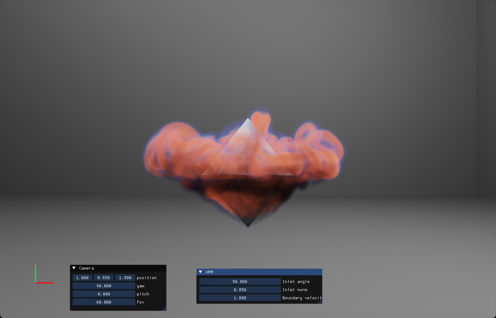

# ONE-STEP FLOW MAPS FOR REAL-TIME FLUID SIMULATION WITH DYNAMIC BOUNDARIES
This repository contains the source code and resources for my master's thesis, 
**One-Step Flow Maps for Real-time Fluid Simulation with Dynamic Boundaries**, completed at the Georgia Institute of Technology.

The project builds upon the Leapfrog Flow Maps (LFM) method for real-time fluid simulation, originally proposed by Sun et al. 
(available [here](https://yuchen-sun-cg.github.io/projects/lfm/)). This implementation introduces key modifications to the original 
LFM framework, specifically:

- **Dynamic Boundary Handling:** 
Integration of a real-time mesh voxelization pipeline to support interaction with arbitrary, moving solid objects.

- **Efficiency Improvements:**
Algorithmic optimizations, including a one-step integration scheme, to enhance performance for real-time applications.

The full thesis document can be found [here](Yutong_Sun_MSCS_Thesis.pdf).


## Build Instructions
We use xmake for cross-platform compilation. We successfully compiled the code on machines with Windows 11 and Nvidia RTX 4080. 

### 1. Clone the repository
```
git clone https://github.com/Mr-222/ofm_dynamic.git
```
### 2. Update submodule (for Vulkan Renderer and AMPCG Poisson Solver)
```
git submodule update --init --recursive
```
### 3. Dependencies
* xmake
* C++ 20
* Cuda 12.6
* Vulkan
* sed, gnuutils

### 4. Build

At proj/

```
xmake build
```

## Run

At proj/sim_render, run the executable file in proj/dynamic_obstacle:
```
.\build\dynamic_obstacle.exe
```

You are expected to see:



## Configuration

In proj/dynamic_obstacle/config